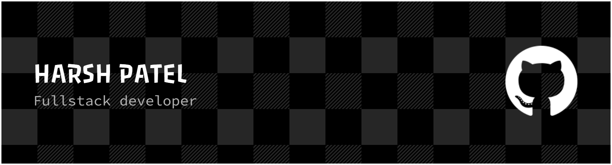

I am currently pursuing a Bachelor's in Computer Science and Engineering, with a keen interest in Full Stack Development. I enjoy building both front-end and back-end applications.

I'm constantly expanding my knowledge in AI, Machine Learning, and Data Science.

I'm passionate about solving real-world problems with code and am always eager to learn and grow in the ever-evolving tech landscape..

 The technologies I choose are always determined by the specific problem I aim to solve.

### 🔥 Tech Stack

#### 💻 Programming Languages

#### ⚙️ Frameworks & Libraries

#### 🗄️ Databases

#### ☁️ Cloud & Hosting

#### 🛠️ Tools

#### 📁 Version Control

### 🌐 Let's Connect:

  

